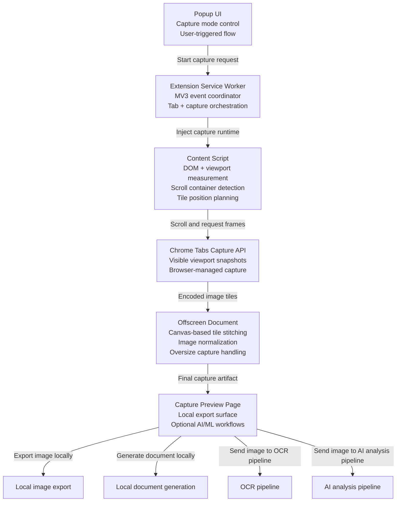

# Full Page Voiceido is a **Manifest V3 + TypeScript Chrome extension**

Full Page Voiceido allows a user to capture the content of the active browser tab as an image.

The extension supports:

- Full-page screenshot capture
- Optional inner-section capture for scrollable containers
- Previewing the captured result inside the extension
- Exporting the capture as PNG or PDF
- Sending the capture to a backend OCR service
- Sending the capture to an AI analysis service
- Running with minimal Chrome permissions

The core screenshot and export flow works locally inside the browser. OCR and AI analysis require the backend service.

---
## High-Level Architecture

---

## Contributing

This repo follows trunk-based development: `main` is always releasable,
every change lands via a Pull Request, and CI must be green before merge.
See [`CONTRIBUTING.md`](./CONTRIBUTING.md) for branch naming, the local
checks CI also runs, and the recommended branch-protection rules for
`main`.

Privacy disclosures are tracked in [`PRIVACY.md`](./PRIVACY.md) and must be
updated in the same PR as any change that affects how user data is
captured, stored, or transmitted.
